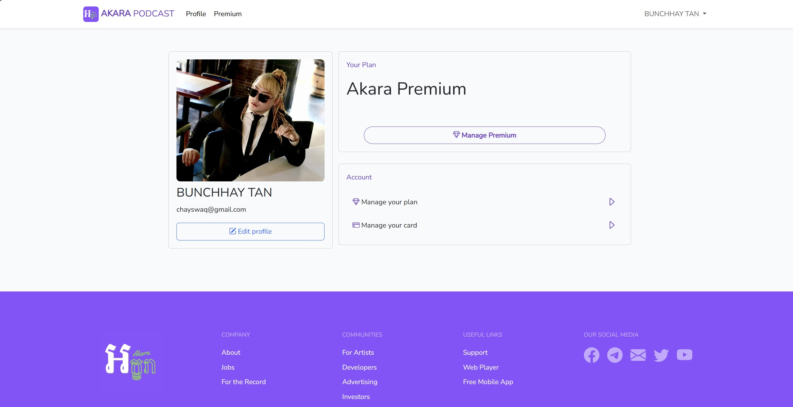

# **Akara Podcast**

The project is a transaction processing system that is being developed as a group assignment for the fourth year of the first semester in university. The aim of the project is to provide a premium subscription for Akara Podcast App.

## Main Features(Frontend & Premium Subscription):

- User authentication: Users can sign up or log in to **Akara Podcast** website
- Premium Subscription Plans: a lot of premium plans that user can purchase.

## Tech Stack:

The application is being developed using the Laravel PHP framework and utilizes several open-source packages. The front-end is built using HTML, CSS, and JavaScript, and utilizes Bootstrap 5 for responsive design. The database is MySQL. A long with stripe integration.

## Purpose:

The purpose of this project is to provide students with an opportunity to learn about transaction processing system, with is an important MIS concept for enterprise system.

## Table of Contents

- [Installation](#installation)
- [Requirement](#requirement)
- [Tools](#tools)

## Installation

1. Clone the repository.

```
git clone https://github.com/Parameow3/akara_pro
```

2. Navigate to the project directory.

```
cd [project directory]
```

3. Install the project dependencies.

```
composer install
```

4. Copy the `.env.example` file and rename it `.env`.

```
cp .env.example .env
```

5. Generate an application key.

```
php artisan key:generate
```

6. Edit the `.env` file and add your database credentials.

```
DB_DATABASE=[your database name]
DB_USERNAME=[your database username]
DB_PASSWORD=[your database password]
```

7. Run the database migrations.

```
php artisan migrate
```

8. Start the server.

```
php artisan serve
```

9. Run Vite.

```
npm run dev
```

## Requirement
- Laravel v10.10.0
- PHP v8.2
- Node v18.14.2
- npm v9.5.0
## Tools
- PHPStorm IDE
- MYSQL Workbench
